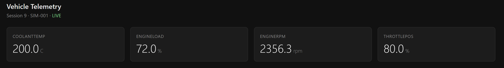
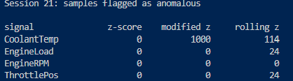

# Vehicle Telemetry & Diagnostics Platform


A simulated automotive telemetry system: a fictional CAN protocol, a C++
encoder/decoder, a threaded processing pipeline with validation and
diagnostics, PostgreSQL persistence, a live web dashboard, and offline
analytics and anomaly detection in Python — containerised with Docker Compose
and built and tested in CI. Built as a learning project to understand how
vehicle networks and telemetry software work.

**This is an educational project.** It is not affiliated with, endorsed by,
or derived from any vehicle manufacturer. The CAN protocol is invented for
this project. No real vehicle data or proprietary specification is used.



[**Demo video**](https://youtu.be/2TDl8FXRYqo) — the pipeline running, the
dashboard updating live, and an injected coolant fault triggering DTC P0001.

## Quick start

Requires only Docker.

```bash
git clone https://github.com/FranciumReact/vehicle-telemetry.git
cd vehicle-telemetry
docker compose up --build
```

Open http://localhost:5000. The database initialises itself, the pipeline
runs a 30-second simulated drive with an injected fault, and the dashboard
shows it live.

To run another drive while the database and dashboard stay up:

```bash
docker compose run --rm pipeline
```

## Motivation

Modern vehicles run dozens of electronic control units communicating over
CAN, a broadcast bus developed by Bosch in 1986. I wanted to understand how
sensor values get packed into 8-byte frames, how they're recovered, and how
a telemetry system processes that stream without dropping data.

Rather than read about it, I built a simplified version end to end.

## Current status

| Component | Status |
|---|---|
| Fictional CAN protocol specification | Done |
| Signal encoding (8/16-bit, bit fields) | Done |
| Vehicle model and frame generation | Done |
| Table-driven decoder | Done |
| Threaded processing pipeline | Done |
| Signal validation (range and rate) | Done |
| Diagnostic trouble code engine | Done |
| PostgreSQL storage | Done |
| Web dashboard | Done |
| Containerisation (Docker Compose) | Done |
| Continuous integration (GitHub Actions) | Done |
| Catch2 test suite, fuzzing, sanitizers | Done |
| Python analytics | Done |
| Statistical anomaly detection | Done |

## Architecture

```
Vehicle model -> Frame builders -> Bounded queue -> Decoder -> Validation -> DTC engine -> PostgreSQL
  (physics)       (bit packing)    (thread-safe)  (table-driven)  (range/rate)  (debounced)      |
                                                                                    +------------+------------+
                                                                                    v                         v
                                                                       Flask API -> Dashboard      Python analytics
                                                                        (JSON)      (browser)      (pandas, batch)
```

The producer thread simulates the vehicle and emits CAN frames at the cycle
times defined in the protocol spec. The consumer thread decodes, validates,
runs diagnostics, and persists the result. A bounded queue with a mutex and
condition variable connects the two, so a slow consumer never stalls the
producer.

Neither the dashboard nor the analytics talks to the C++ pipeline directly —
the database is the handoff point, which is how real telemetry systems keep
ingestion and query independent.

Under Docker Compose each of these runs in its own container:

```
db          PostgreSQL 16, schema and seed loaded on first start
pipeline    the C++ binary
dashboard   Flask, published on port 5000
```

## The CAN protocol

Five messages, fully documented in [docs/can_protocol.md](docs/can_protocol.md).

| CAN ID | Name | Sender | Cycle |
|---|---|---|---|
| 0x100 | ENGINE_DATA | ECM | 10 ms |
| 0x101 | VEHICLE_DYNAMICS | ABS | 10 ms |
| 0x102 | BATTERY_DATA | BCM | 1000 ms |
| 0x103 | POWERTRAIN_STATUS | TCM | 100 ms |
| 0x300 | DIAGNOSTIC_DATA | any | event-driven |

Every signal specifies a start bit, length, scaling factor, offset, unit,
valid range, and maximum plausible rate of change. The decoder and both
validators are driven entirely by this table — adding a signal requires no
code changes.

Signals are not all byte-aligned. FuelRate, for example, is 16 bits
starting at bit 3, so it straddles three bytes.

## Validation and diagnostics

These are deliberately separate concerns.

**Validation** asks whether a reading is physically possible. A coolant
temperature of 200 °C is not a hot engine, it's a broken sensor. Range
checks compare against per-signal bounds; rate checks compare against the
previous reading and reject changes faster than the real world allows.

**Diagnostics** ask whether the vehicle is behaving badly. A coolant
temperature of 115 °C is a perfectly valid reading that indicates
overheating. The data is trustworthy; the vehicle isn't.

Diagnostic trouble codes are debounced: a condition must hold for 10
consecutive cycles before a code is confirmed, and clear for 10 cycles
before it heals. This mirrors how production ECUs avoid setting codes on a
single noisy sample. Only state transitions are reported as events, not the
ongoing condition.

The difference shows in the output. A 30-second run with a 200-frame
injected overheat produces 200 range violations, 2 rate violations (the jump
in and the recovery), and exactly one confirmed DTC:

```
DTC P0001 SET at t=15.10
DTC P0001 CLEARED at t=17.10
decoded 3000, out of range 200, implausible rate 2, dropped 0
```

The fault starts at t=15.00 and the code confirms at 15.10 — ten cycles
later, as designed. Isolated single-frame spikes produce range violations
but no DTC at all.

## Database schema

Five tables: `sessions`, `signals`, `telemetry`, `dtc_catalog`, and
`dtc_events`. Schema and seed data are in [database/](database/).

**Normalized reference data.** `telemetry` stores a 4-byte integer
`signal_id` rather than repeating the string `"EngineRPM"` on every row. At
400 readings per second that string would be the majority of the table's
size, and a typo such as `"EngineRPMM"` would silently create a phantom
signal. The same reasoning puts DTC descriptions and severities in
`dtc_catalog` instead of on every event row.

**Foreign keys enforce integrity.** A telemetry row cannot reference a
session that does not exist, and a DTC event cannot reference a code that
is not in the catalog. Deleting a session with telemetry still attached is
refused rather than silently orphaning rows.

**Two timestamps, deliberately.** `vehicle_time` is when the vehicle
observed a value; `recorded_at` is when this system stored it. The gap
between them is ingestion lag, which is measurable because both are kept.
Analysis indexes on `vehicle_time`, because batched inserts share a single
`recorded_at` across the whole transaction and it is therefore not unique
per sample.

**Indexes match the query patterns.** The composite index on
`telemetry(session_id, vehicle_time)` serves the most common query — one
session's data in time order — for both filtering and sorting. Column order
matters: the reverse would not serve that query.

**Key width chosen by expected row count.** `sessions.id` is `SERIAL`
(32-bit), which is ample. `telemetry.id` is `BIGSERIAL`, because at 400
rows/sec a 32-bit key would be exhausted in roughly two months of
continuous logging.

**TIMESTAMPTZ, not TIMESTAMP.** Vehicles cross time zones. Storing an
absolute instant keeps data from different regions comparable.

**A nullable column carries meaning.** `sessions.ended_at` is NULL while a
session is still recording. That single column is what lets the dashboard
distinguish a live run from a historical one, without any extra state.

Reassembling the normalized data is a join:

```sql
SELECT s.name, avg(t.value), min(t.value), max(t.value)
FROM telemetry t
JOIN signals s ON s.id = t.signal_id
WHERE t.session_id = 1
GROUP BY s.name;
```

That is the trade-off: a small read-time cost in exchange for a large
write-time and storage saving.

## Dashboard

A Flask backend serves JSON from PostgreSQL; a single static HTML page polls
it once a second and renders the current value of every signal.

**Polling rather than WebSocket.** At a 1 Hz refresh the two are
indistinguishable to the eye, and polling is stateless, far less code, and
has no reconnection logic to get wrong. WebSocket would earn its complexity
at higher update rates or with many concurrent clients; here it would not.

**Live and historical look different.** The page reads `session.live`, which
the API derives from `ended_at IS NULL`. A finished session shows its end
time instead of a live indicator.

**Failure looks different from idle.** If the fetch throws, the page says so
rather than leaving stale numbers on screen. A dashboard showing nothing and
a dashboard that is broken must not look the same to the person reading it.

**Latest value per signal in one query.** Postgres `DISTINCT ON (s.name)`
with `ORDER BY s.name, t.recorded_at DESC` returns the most recent row for
each signal in a single round trip, rather than one query per signal.

## Analytics

The pipeline is a **streaming** system: it processes one frame at a time and
remembers nothing beyond the last value. That keeps memory bounded and lets
it run indefinitely, but it cannot look backwards. `python/analyse.py` is
the **batch** counterpart — it loads a whole session into pandas and computes
over all of it at once.

```
$ python python/analyse.py 17
Session 17: 3000 samples over 30.0s, 4 signals

              count     mean     std     min     max
CoolantTemp  3000.0    40.84   42.87   20.00   200.0
EngineLoad   3000.0    59.88   10.39   36.00    72.0
EngineRPM    3000.0  2232.58  836.53  800.75  3434.0
ThrottlePos  3000.0    66.54   11.55   40.00    80.0

Ingestion lag (seconds):
  mean   0.1157   median 0.1172   p95 0.2276   max 0.2826
```

CoolantTemp's standard deviation is larger than its mean, which for a
temperature reading is not physically sensible. That is the injected fault
showing up as a distribution shape: roughly 2800 samples near 25 °C and 200
at 200 °C. ThrottlePos, by contrast, is unremarkable.

**Long to wide.** The database stores one row per reading, so adding a
signal needs no schema change. Analysis wants one column per signal. The
reshape happens in pandas rather than SQL: Postgres can pivot, but it needs
an extension and the column names must be hardcoded, whereas `DataFrame.pivot`
discovers them from the data. The general rule is to filter and aggregate in
SQL, where the indexes are, and do shape manipulation in pandas.

## Anomaly detection



Four things get conflated constantly, and this project only does the first
two:

- **Anomaly detection** — this data is statistically unlike the rest. Says
  nothing about cause. A cold start looks anomalous; so does a failing sensor.
- **Fault detection** — a specific known-bad condition occurred. The DTC
  engine does this: coolant above 110 °C is a defined fault with a defined
  threshold.
- **Predictive maintenance** — this component will likely fail within N
  hours. Needs historical failure data across many vehicles. Not done here.
- **Mechanical diagnosis** — naming the failed part. Needs physical
  inspection or a model of the failure mode. Not done here.

`python/anomaly.py` implements three detectors and compares them rather than
picking one on faith.

**Z-score** measures distance from the mean in standard deviations. Simple
and interpretable, but it assumes roughly normal data and suffers from
*masking*: the outliers inflate the very standard deviation used to judge
them.

**Modified z-score** uses the median and median absolute deviation instead.
A median barely moves when a minority of samples go extreme, so the baseline
stays anchored to healthy data.

**Rolling z-score** compares each point to the preceding 200 samples rather
than to the whole session, and excludes the current point from its own
baseline.

### The comparison

Two sessions, identical except for how long the injected 200 °C fault lasted.
CoolantTemp's true anomaly count is known exactly, because the fault was
injected deliberately; the other three signals should be clean.

| Fault length | z-score | modified z | rolling z |
|---|---|---|---|
| 200 of 3000 samples (6.7%) | 200 ✓ | 200 ✓ | 131, plus 48 false positives |
| 1000 of 3000 samples (33%) | **0** ✗ | 1000 ✓ | 114, plus 48 false positives |

**Z-score fails completely on the longer fault.** Predicted before running
it, from the arithmetic: as the fault lengthens, the mean rises toward the
fault value *and* the distribution becomes bimodal, so the standard
deviation rises too. Both changes shrink the score. At 33% contamination
z falls to about 1.4, below the threshold of 3, and the detector reports all
clear. That is masking, and it is the worst failure mode a detector can
have — silence rather than an error.

**Modified z-score is unaffected**, because the median of a 2:1 split still
sits in the healthy cluster.

**Rolling z-score is worse on both counts.** It misses samples because once
the fault has run for a full window, the window *is* the fault and the local
baseline has moved. Its false positives land on ThrottlePos and EngineLoad
during the steep parts of the drive cycle's sine wave, where a short window
has a small spread while the signal is moving fast — a small denominator
against a real numerator.

**Conclusion: use the modified z-score.** Not because it is the most
sophisticated, but because it is the only one of the three that survived
both cases.

### What this does not show

Every one of these detectors found a fault that was injected on purpose into
simulated data, with the ground truth known in advance. On real vehicle data
there would be no labels, thresholds would need tuning against observed fault
rates, and entirely normal behaviour — a cold start, an aggressive driver, a
cold morning — would look anomalous without anything being wrong.

## Investigation: ingestion lag

Because both timestamps are stored, the delay between a value being observed
and being written is measurable. The investigation is worth recording because
three plausible explanations were wrong before the real one appeared.

**The measurement.** Mean ingestion lag came out at **0.49 s**, with a max
near 1.0 s. Expected was ~0.125 s: a 100-row batch at 400 rows/sec fills in
0.25 s, so the average row should wait half that. Four times off.

**Hypothesis 1 — rows wait too long in the buffer.** Testable: shrink
`kBatchSize` from 100 to 10 and lag should fall roughly tenfold. It fell to
0.37 s, about 25%. **Disproved.**

**Hypothesis 2 — the per-row INSERT costs too many round trips.** `flush()`
issued one statement per buffered row. Replacing it with a single multi-row
INSERT should help. Lag rose to 0.62 s. Re-running against an empty table to
rule out index-growth effects still gave 0.58 s. **Disproved.**

**Hypothesis 3 — the consumer cannot keep up.** Instrumenting `flush()`
directly showed it taking 4–26 ms, typically 9 ms — about 4% of the
consumer's time, far too little to explain 580 ms. Adding a queue-depth
probe showed depth **0 at every sample** across the entire run.
**Disproved.**

**The actual cause — the clocks disagreed.** `vehicle_time` is a counter:
the consumer adds 0.01 per frame. Wall time is not. `sleep_for(10ms)`
guarantees *at least* 10 ms and the loop then does work on top, so each
iteration cost slightly more than 10 ms and the error accumulated. Comparing
`ended_at - started_at` against simulated duration confirmed it: **30.92 s of
wall clock for 30.00 s of simulated time**. That 0.9 s of drift, accumulating
linearly, was most of what the "lag" metric had been reporting.

**The fix.** `sleep_until` with an absolute deadline instead of `sleep_for`
with a fixed duration. The deadline advances by exactly 10 ms each iteration,
so the loop's own work is absorbed rather than added.

| | Before | After |
|---|---|---|
| Wall clock for a 30 s run | 30.92 s | 30.05 s |
| Mean ingestion lag | 0.49 s | 0.116 s |
| p95 ingestion lag | 0.86 s | 0.228 s |
| Max ingestion lag | 0.97 s | 0.283 s |

The remaining 0.116 s mean and 0.283 s max now match the theoretical
batch-fill prediction of 0.125 s and 0.25 s, which is the sign the metric is
finally measuring what it claims to.

**What it taught.** A latency metric is only as trustworthy as the clocks it
is built from; comparing a wall clock to a synthetic counter measures the
difference between the clocks, not the system. And a benchmark is only valid
if everything except the variable under test is held constant — the second
hypothesis was initially measured against a table that had grown by 24,000
rows, which had to be ruled out separately.

## Design decisions

**Table-driven decoding.** Signal parameters live in one data structure
rather than being hardcoded at each call site. This came from getting
burned: a mistyped scaling factor (0.04 instead of 0.4) produced
plausible-looking but wrong output with no error.

**Reject malformed frames rather than partially decode them.** A frame
whose DLC doesn't match the spec is discarded and counted. Partial decoding
would mean bounds-checking every signal individually, and a sensor value
you can't trust is worse than no value. The sanitized fuzzing run is the
evidence that this decision holds.

**Bounded queue with a drop counter.** An unbounded queue under sustained
overload ends in an out-of-memory kill. Dropping the oldest frame and
counting the loss makes overload visible and survivable.

**std::optional for fallible operations.** Decoding can fail on an unknown
ID or a DLC mismatch. Returning an optional makes the failure explicit
rather than smuggling it through a sentinel value.

**Validation bounds are physical, not representational.** CoolantTemp can
encode up to 215 °C, but its valid range stops at 130 °C. Using the encoding
limit would mean validation only ever catches encoding errors, never sensor
faults.

**Batched database writes.** Readings are buffered and written 100 at a time
as a single multi-row INSERT in one transaction. The cost is durability — up
to one batch can be lost on a crash — which is acceptable for 100 Hz samples
where the next one arrives in 10 ms, and would not be for financial data.

**Absolute deadlines in the real-time loop.** `sleep_until` rather than
`sleep_for`, so per-iteration work does not accumulate into timing drift.

**RAII for database lifetime.** The writer's destructor flushes the buffer
and closes the session, so no code path can exit without the data being
written and `ended_at` being set.

**Parameterised queries throughout.** Values are sent separately from the
SQL text, so they can never be interpreted as SQL. The multi-row INSERT
builds placeholder text dynamically but never interpolates a value.

**Detectors evaluated, not assumed.** The anomaly-detection methods were
compared against a known ground truth across two contamination levels, and
the simplest one was rejected on evidence rather than kept because it looked
reasonable.

## Performance

Measured on a 13th Gen Intel Core i9-13900H (WSL2, Ubuntu), single producer
and single consumer thread:

- Decode throughput: ~645,000 frames/sec unthrottled
  (three runs: 650k / 642k / 647k)
- Ingestion lag at protocol cycle times: 0.116 s mean, 0.283 s max
- Timing drift over a 30-second run: 51 ms
- Zero frames dropped, queue depth 0 throughout

Under the unthrottled test the producer outruns the consumer and roughly 90%
of frames are evicted by the queue's drop policy. That is the intended
behaviour under overload — bounded memory, counted loss — not a failure.

For context: a classic CAN frame with 8 data bytes occupies roughly 110-130
bits on the wire once identifier, CRC, ACK, and stuffing overhead are
included. At 500 kbit/s that puts the theoretical ceiling near 4,000 frames
per second, and real buses are typically run well below saturation because
arbitration latency degrades as load approaches the limit.

## Testing

The suite uses [Catch2](https://github.com/catchorg/Catch2) v3, pulled in by
CMake's `FetchContent` so nothing has to be installed first. It runs through
CTest, locally and in CI.

**Round-trip tests** encode known physical values, decode them back, and
assert the result is within one quantisation step. Exact float comparison is
not valid here — 33% throttle encodes to a raw value that decodes as 33.2%,
because an 8-bit field with factor 0.4 has 0.4% resolution. The tolerance
for each signal is that signal's own resolution.

**Rejection tests** confirm that unknown identifiers and DLC values shorter
or longer than the spec are refused rather than silently decoded.

**Debouncing tests** verify the DTC engine's state machine directly: nine
consecutive faulting cycles produce no event, the tenth produces exactly one
SET event, and continuing to fault produces nothing further because only
transitions are events.

**Fuzzing.** 10,000 frames with random identifiers, random DLC values, and
random payload bytes are fed to the decoder. There is no correct output for
random input, so the property asserted is not correctness but survival: the
decoder must return without crashing, hanging, or reading past the end of
the payload.

**Sanitizers.** A second CI job rebuilds the suite with AddressSanitizer and
UndefinedBehaviorSanitizer and runs it again. ASan instruments every memory
access, so the fuzzing test becomes a real memory-safety check rather than
an assumption. It passes clean, and the reason is structural: `decode_frame`
rejects any frame whose DLC does not match the spec before touching the
payload, so malformed frames never reach the bit-extraction code at all.

**Fault injection** in the simulator exercises both validators and the DTC
engine on every run of the pipeline itself.

Run them with:

```bash
cmake -S . -B build && cmake --build build
ctest --test-dir build --output-on-failure
```

## Containerisation and CI

**One command to run everything.** Docker Compose starts PostgreSQL, the
pipeline, and the dashboard as three containers on a private network.
Without it, running the project took eleven manual setup steps.

**Configuration through the environment paid off here.** Both the C++ and
Python sides read their connection string from `TELEMETRY_DB`. Inside Compose
the database is a separate host named `db`, not a local socket — and moving
to it required no code change, only a different environment variable.

**Multi-stage build for the pipeline.** The first stage has the compiler,
CMake, and development headers; the final image contains only the binary
and the one shared library it links against. The toolchain never ships.

**Readiness, not just startup.** PostgreSQL takes a few seconds to accept
connections. A healthcheck using `pg_isready`, combined with
`depends_on: condition: service_healthy`, makes the pipeline and dashboard
wait until the database is actually ready. Plain `depends_on` only waits for
the container to start, which is a common source of intermittent failures.

**The database port is not published.** Containers reach it over the
Compose network, so it is never exposed to the host.

**The Flask debugger is never exposed.** It allows arbitrary code execution,
so it is enabled only when the server is bound to localhost. Inside the
container, where Flask must bind to `0.0.0.0`, it is off.

**Line-buffered output.** When stdout is a pipe rather than a terminal, C
switches to full buffering and holds output until exit. The pipeline sets
line buffering explicitly so its logs appear in `docker compose logs` as
they happen.

**CI on every push and pull request.** Two jobs run in parallel on a clean
Ubuntu 24.04 runner: a normal build with the test suite, and a sanitized
build. CI was verified by deliberately breaking a scaling factor on a branch
and confirming the check failed and blocked the pull request.

## Building without Docker

Requires CMake 3.16+, a C++17 compiler, PostgreSQL, libpqxx, and Python 3.

```bash
sudo apt install build-essential cmake postgresql libpqxx-dev python3-venv
```

Set up the database:

```bash
sudo service postgresql start
sudo -u postgres createuser --superuser "$USER"
sudo -u postgres createdb vehicle_telemetry --owner "$USER"
psql -d vehicle_telemetry -f database/schema.sql
psql -d vehicle_telemetry -f database/seed.sql
```

Build and run the pipeline:

```bash
cmake -S . -B build
cmake --build build
./build/encode_test                          # 30-second drive cycle
ctest --test-dir build --output-on-failure   # test suite
```

Run the dashboard in a second terminal, then open http://localhost:5000:

```bash
python3 -m venv .venv
source .venv/bin/activate
pip install -r dashboard/requirements.txt
python dashboard/app.py
```

Analyse a stored session:

```bash
pip install pandas numpy
python python/analyse.py <session_id>    # statistics and ingestion lag
python python/anomaly.py <session_id>    # detector comparison
```

Built with `-Wall -Wextra -Werror`. The connection string is read from
`TELEMETRY_DB` on both the C++ and Python sides, falling back to
`dbname=vehicle_telemetry`.

## Limitations

- Simulated CAN only. No hardware, no SocketCAN, no real vehicle data.
- The vehicle model is crude and not physically accurate. It produces
  plausible-looking values, not a validated engine simulation.
- No AUTOSAR, ISO 26262, or MISRA compliance. This is not safety-relevant
  code and makes no claim to be.
- Classic CAN only: 11-bit identifiers, 8-byte payloads. No CAN FD.
- Little-endian signals only, though the design allows byte order to be a
  per-signal property.
- Rate-of-change validation is bounded by signal quantisation. A coarse
  signal such as coolant temperature (1 °C steps at a 10 ms cycle) registers
  a single step as 100 °C/sec, so meaningful rate limits below that are not
  enforceable at this sample rate.
- The DTC engine detects threshold conditions in telemetry. It does not
  diagnose mechanical faults and makes no predictive claims.
- Anomaly detection was evaluated only against deliberately injected faults
  in simulated data, where the ground truth is known by construction. No
  claim is made about performance on real telemetry, where thresholds would
  need tuning and normal-but-unusual behaviour would produce false positives.
- The detectors run offline over completed sessions. Nothing feeds their
  output back into the live pipeline or the dashboard.
- Schema changes are applied by hand. There is no migration tool, so adding
  `vehicle_time` meant an `ALTER TABLE` against the running database and a
  separate edit to `schema.sql`, which a real project would keep in one
  versioned place.
- Validation failures are counted but not persisted. Only their aggregate
  effect on DTCs reaches the database.
- The dashboard runs on Flask's development server, which is single-threaded
  and not suitable for deployment. It also shows only current values; there
  are no historical charts yet.
- There is no authentication on the API. It assumes a trusted local
  environment.
- The Compose file uses a hardcoded development database password. A real
  deployment would inject it as a secret.
- There are no database integration tests. The test suite covers the decode,
  validation, and diagnostic layers, all of which are pure functions or
  in-memory state; the persistence layer is exercised only by running the
  pipeline.
- The fuzzing test uses a fixed seed so failures are reproducible. That makes
  it a regression test over one fixed set of inputs rather than a continuous
  search for new ones.
- Residual timing drift of ~51 ms over 30 seconds remains. Eliminating it
  entirely would need a real-time scheduler, which a general-purpose OS does
  not provide.

## Possible extensions

Historical charts on the dashboard, anomaly results written back to the
database and surfaced live, CAN FD support, and a SocketCAN backend so the
decoder could read a real bus.

## Repository layout

```
include/            headers
src/                implementation
tests/              Catch2 test suite
database/           schema and seed SQL
dashboard/          Flask API, static page, requirements
python/             offline analytics and anomaly detection
docker/             Dockerfiles for the pipeline and dashboard
docs/               protocol specification and screenshots
.github/workflows/  CI configuration
docker-compose.yml  full-system orchestration
```